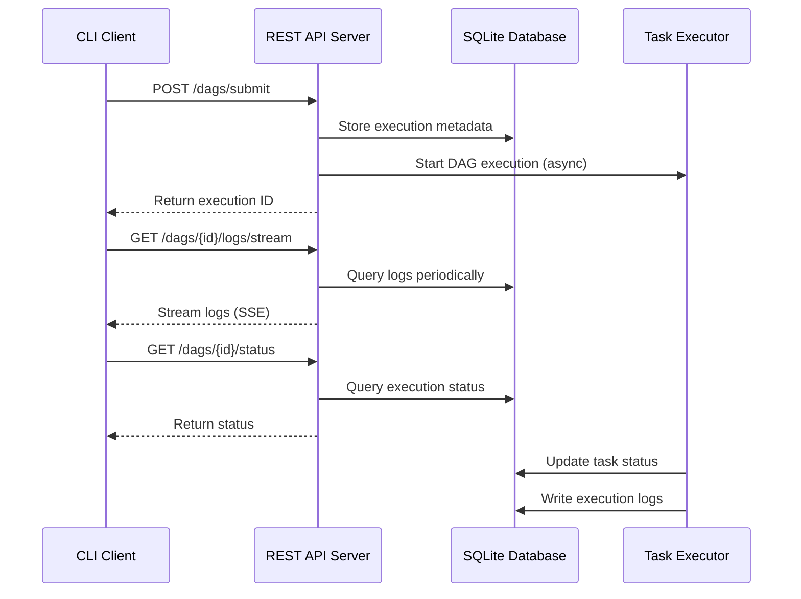
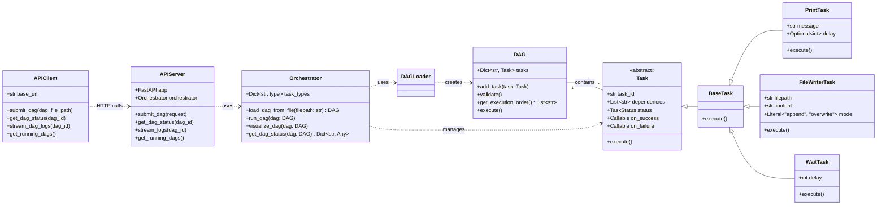

# Maestro - Python Task Orchestrator


[](https://opensource.org/licenses/MIT)
[](https://www.python.org/downloads/release/python-3130/)

> Maestro is a production-ready Python task orchestrator that runs DAGs (Directed Acyclic Graphs) with a modern client-server architecture similar to Docker.

## Features

### 🏗️ **Client-Server Architecture**
- **REST API Server**: Persistent backend service for DAG execution
- **Lightweight CLI Client**: Docker-like command interface
- **Independent Execution**: DAGs run continuously even when client disconnects
- **Multiple Client Support**: Connect from multiple terminals to the same server

### 🚀 **Core Capabilities**
- **DAG-based task execution:** Define complex workflows with dependencies
- **Multi-threaded execution:** Run DAGs asynchronously with concurrent task execution
- **Multi-executor support:** Execute tasks on different platforms (local, SSH, Docker, Kubernetes)
- **Database persistence:** Track execution history and status with SQLite database
- **Real-time monitoring:** Monitor DAG execution progress with rich UI
- **Enhanced CLI interface:** Comprehensive command-line interface with monitoring and management
- **Execution lifecycle management:** Start, monitor, cancel, and cleanup DAG executions
- **YAML configuration:** Easily define your DAGs in a human-readable format
- **Extensible:** Create your own custom task types and executors
- **Comprehensive logging:** Detailed execution logs with filtering and real-time streaming
- **Status tracking:** Persistent task and DAG status with resume capabilities

### 🔄 **Live Streaming**
- **Real-time log streaming:** Server-Sent Events (SSE) for live log updates
- **Efficient filtering:** Client-side log deduplication and filtering
- **Graceful reconnection:** Automatic retry logic for network issues

## Installation

```bash
# Clone the repository
git clone https://github.com/your-username/maestro.git
cd maestro

# Install dependencies (including test dependencies) using uv
uv sync --extra test

# Install the project in editable mode for local development
uv pip install -e .
```

## Usage

Maestro provides two interfaces: a modern **client-server architecture** (recommended) and a legacy **standalone CLI**.

### 🆕 Client-Server Architecture (Recommended)

#### Starting the Server

```bash
# Start server in daemon mode
maestro server start --daemon --port 8000

# Start server in foreground
maestro server start --port 8000

# Check server status
maestro server status
```

#### Using the Client

```bash
# Submit a DAG for execution
maestro submit examples/sample_dag.yaml

# Check DAG status
maestro status sample_dag

# View logs
maestro logs sample_dag --limit 50

# Attach to live logs (real-time streaming)
maestro attach sample_dag

# List running DAGs
maestro running

# List all DAGs with optional filtering
maestro list --active

# Cancel a DAG
maestro cancel sample_dag

# Validate a DAG
maestro validate examples/sample_dag.yaml

# Clean up old executions
maestro cleanup --days 30
```

#### Server Options

```bash
# Custom host and port
maestro server start --host 0.0.0.0 --port 8080

# Different log levels
maestro server start --log-level debug

# Connect to remote server
maestro status sample_dag --server http://remote-host:8080
```

### 📚 Legacy Standalone CLI

#### Running a DAG

```bash
# Run a DAG asynchronously (default)
maestro run examples/sample_dag.yaml

# Run a DAG in the background
maestro run-async examples/sample_dag.yaml
```

#### Validating a DAG

```bash
maestro validate examples/sample_dag.yaml
```

#### Visualizing a DAG

```bash
maestro visualize examples/sample_dag.yaml
```

### Monitoring and Management

#### Monitor DAG execution in real-time

```bash
maestro monitor my_dag_id
```

#### Check DAG status

```bash
# Show all running DAGs
maestro status

# Show specific DAG status
maestro status my_dag_id
```

#### View execution logs

```bash
maestro logs my_dag_id
```

#### List all DAGs

```bash
# List all DAGs
maestro list-dags

# Filter by status
maestro list-dags --status running
```

#### View execution history

```bash
maestro history my_dag_id
```

#### Get summary statistics

```bash
maestro summary
```

#### Cancel running DAG

```bash
maestro cancel my_dag_id
```

#### Cleanup old records

```bash
# Clean up records older than 30 days
maestro cleanup --days 30

# Dry run to see what would be deleted
maestro cleanup --days 30 --dry-run
```

#### Attach to live logs

```bash
# Attach to live log stream
maestro attach my_dag_id

# Filter by task
maestro attach my_dag_id --task task_name

# Filter by log level
maestro attach my_dag_id --level ERROR
```

## Multi-Executor Support

Maestro supports running tasks on different execution environments:

### Available Executors

- **Local Executor** (default): Runs tasks on the local machine
- **SSH Executor**: Execute tasks on remote machines via SSH
- **Docker Executor**: Run tasks in Docker containers
- **Kubernetes Executor**: Execute tasks as Kubernetes jobs

### Configuring Executors

Specify the executor in your DAG configuration:

```yaml
dag:
  name: "multi_executor_dag"
  tasks:
    - task_id: "local_task"
      type: "PrintTask"
      executor: "local"  # Default
      params:
        message: "Running locally"
    
    - task_id: "ssh_task"
      type: "PrintTask"
      executor: "ssh"
      params:
        message: "Running via SSH"
    
    - task_id: "docker_task"
      type: "PrintTask"
      executor: "docker"
      params:
        message: "Running in Docker"
```

### Creating Custom Executors

To create a custom executor:

1. Create a class that inherits from `maestro.core.executors.base.BaseExecutor`
2. Implement the `execute(self, task)` method
3. Register it with the executor factory

```python
from maestro.core.executors.base import BaseExecutor

class CustomExecutor(BaseExecutor):
    def execute(self, task):
        # Your custom execution logic here
        task.execute_local()

# Register the executor
orchestrator.executor_factory.register_executor("custom", CustomExecutor)
```

## Configuration

DAGs are defined in YAML files. Here's an example:

```yaml
dag:
  name: "esempio_dag"
  tasks:
    - task_id: "task_1"
      type: "PrintTask"
      params:
        message: "Inizio pipeline"
        delay: 2
      dependencies: []
    
    - task_id: "task_2"
      type: "FileWriterTask"
      params:
        filepath: "output.txt"
        content: "Risultato elaborazione"
      dependencies: ["task_1"]
    
    - task_id: "task_3"
      type: "PrintTask"
      params:
        message: "Fine pipeline"
      dependencies: ["task_2"]
```

## Creating Custom Tasks

To create a custom task, you need to:

1.  Create a new class that inherits from `maestro.tasks.base.BaseTask`.
2.  Define the parameters for your task as Pydantic fields.
3.  Implement the `execute` method.
4.  Register your new task in the `Orchestrator`'s `task_types` dictionary.

## Architecture

### Client-Server Architecture Diagram



### Interface Comparison

| Feature | Client-Server | Legacy CLI |
|---------|---------------|------------|
| **Execution Model** | Persistent server | Process-based |
| **DAG Persistence** | ✅ Survives client disconnect | ❌ Dies with process |
| **Multi-client Support** | ✅ Multiple clients | ❌ Single process |
| **Live Log Streaming** | ✅ Real-time SSE | ✅ Terminal attach |
| **Remote Access** | ✅ Network accessible | ❌ Local only |
| **Resource Usage** | Lower client overhead | Higher memory usage |
| **Deployment** | Production ready | Development/testing |

### Class Diagram



## Testing

Maestro includes a comprehensive test suite covering all major functionality:

### Test Categories

#### Core Functionality Tests
- **DAG Operations**: DAG creation, validation, cycle detection
- **Task Execution**: Task lifecycle, dependencies, status tracking
- **Database Features**: Persistence, state management, resume functionality

#### Multi-Executor Tests
- **Executor Factory**: Registration, retrieval, thread safety
- **Custom Executors**: Creation, registration, isolation
- **Executor Integration**: Orchestrator integration, error handling

#### Enhanced CLI Tests
- **Status Management**: DAG execution tracking, history, summaries
- **Database Operations**: Cleanup, cancellation, log management
- **CLI Integration**: Command scenarios, data format validation

#### Performance & Concurrency Tests
- **Thread Safety**: Concurrent status updates, database access
- **Async Execution**: Background DAG execution, monitoring
- **Resource Management**: Database connection handling, cleanup

### Running Tests

```bash
# Run all tests
./run_tests.sh

# Run specific test categories
uv run pytest tests/test_multi_executor.py -v          # Multi-executor tests
uv run pytest tests/test_enhanced_cli.py -v           # Enhanced CLI tests
uv run pytest tests/test_db_feature.py -v             # Database features
uv run pytest tests/test_dag.py -v                    # DAG operations
uv run pytest tests/test_orchestrator_dagloader.py -v # Orchestrator tests

# Run tests with coverage
uv run pytest --cov=maestro --cov-report=html
```

### Test Coverage

- ✅ **Multi-executor support**: 13/13 tests passing
- ✅ **Enhanced CLI features**: 15/15 tests passing (non-concurrent)
- ✅ **Database operations**: 4/4 tests passing
- ✅ **DAG functionality**: 3/3 tests passing
- ✅ **Orchestrator features**: 5/5 tests passing
- ⚠️ **Concurrent execution**: Limited by SQLite threading constraints

### Known Limitations

- **SQLite Threading**: Concurrent database access may cause issues in heavy multi-threading scenarios
- **Test Isolation**: Some concurrent tests may experience timing-related failures

### Continuous Integration

For production use, consider:
- Using PostgreSQL or MySQL for better concurrent access
- Implementing connection pooling for database operations
- Adding integration tests for specific deployment environments
