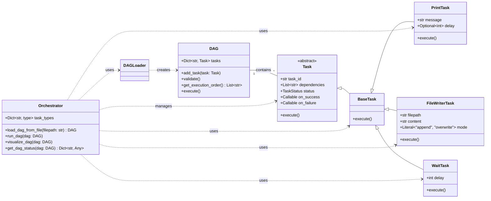

# Maestro - Python Task Orchestrator

[](https://opensource.org/licenses/MIT)
[](https://www.python.org/downloads/release/python-3130/)


Maestro is a simple Python task orchestrator that runs a series of tasks defined in a DAG (Directed Acyclic Graph).

## Features

- **DAG-based task execution:** Define complex workflows with dependencies.
- **Multi-threaded execution:** Run DAGs asynchronously with concurrent task execution.
- **Database persistence:** Track execution history and status with SQLite database.
- **Real-time monitoring:** Monitor DAG execution progress with rich UI.
- **YAML configuration:** Easily define your DAGs in a human-readable format.
- **Extensible:** Create your own custom task types.
- **Enhanced CLI interface:** Comprehensive command-line interface with monitoring and management.
- **Execution lifecycle management:** Start, monitor, cancel, and cleanup DAG executions.

## Installation

```bash
# Clone the repository
git clone https://github.com/your-username/maestro.git
cd maestro

# Install dependencies (including test dependencies) using uv
uv sync --extra test

# Install the project in editable mode for local development
uv pip install -e .
```

## Usage

### Basic Commands

#### Running a DAG

```bash
# Run a DAG asynchronously (default)
maestro run examples/sample_dag.yaml

# Run a DAG in the background
maestro run-async examples/sample_dag.yaml
```

#### Validating a DAG

```bash
maestro validate examples/sample_dag.yaml
```

#### Visualizing a DAG

```bash
maestro visualize examples/sample_dag.yaml
```

### Monitoring and Management

#### Monitor DAG execution in real-time

```bash
maestro monitor my_dag_id
```

#### Check DAG status

```bash
# Show all running DAGs
maestro status

# Show specific DAG status
maestro status my_dag_id
```

#### View execution logs

```bash
maestro logs my_dag_id
```

#### List all DAGs

```bash
# List all DAGs
maestro list-dags

# Filter by status
maestro list-dags --status running
```

#### View execution history

```bash
maestro history my_dag_id
```

#### Get summary statistics

```bash
maestro summary
```

#### Cancel running DAG

```bash
maestro cancel my_dag_id
```

#### Cleanup old records

```bash
# Clean up records older than 30 days
maestro cleanup --days 30

# Dry run to see what would be deleted
maestro cleanup --days 30 --dry-run
```

## Configuration

DAGs are defined in YAML files. Here's an example:

```yaml
dag:
  name: "esempio_dag"
  tasks:
    - task_id: "task_1"
      type: "PrintTask"
      params:
        message: "Inizio pipeline"
        delay: 2
      dependencies: []
    
    - task_id: "task_2"
      type: "FileWriterTask"
      params:
        filepath: "output.txt"
        content: "Risultato elaborazione"
      dependencies: ["task_1"]
    
    - task_id: "task_3"
      type: "PrintTask"
      params:
        message: "Fine pipeline"
      dependencies: ["task_2"]
```

## Creating Custom Tasks

To create a custom task, you need to:

1.  Create a new class that inherits from `maestro.tasks.base.BaseTask`.
2.  Define the parameters for your task as Pydantic fields.
3.  Implement the `execute` method.
4.  Register your new task in the `Orchestrator`'s `task_types` dictionary.

## Class Diagram



## Running Tests

To run all tests, use the provided script:

```bash
./run_tests.sh
```
